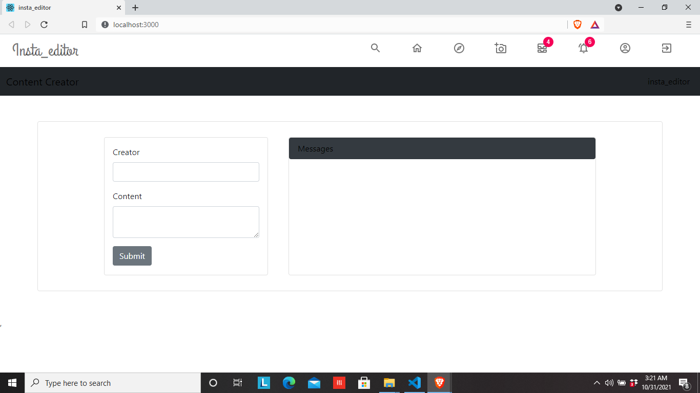
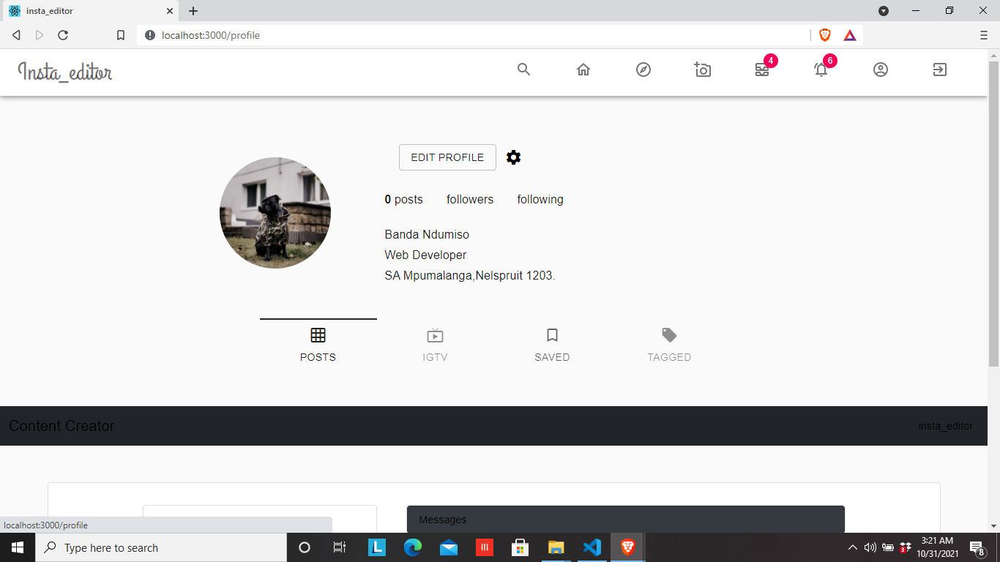
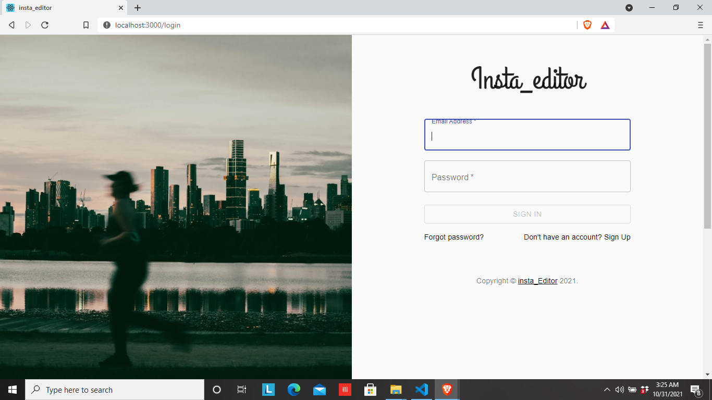

# Insta-editor

<p align="center">
  <a href="https://www.mongodb.com/mern-stack">
    
  </a>
  <a href="https://jwt.io/">
    <img alt="jwt" src="data:image/jpeg;base64,/9j/4AAQSkZJRgABAQAAAQABAAD/2wCEAAkGBw0NDQ4NDQ0NDQ4OEA4QDQ8ODQ8NDQ0OFREWFxYRExUYHSogGBonHhYVLTEhJSk3Li8uFx8zODMsNygtLisBCgoKDg0OGhAQGy8dICUwLTczLS0tLS0tLTItLS0tNy0tLSstLS0tLS03LS0rLS0tLS0tLS0tLS0tLS0tLTcrLf/AABEIAN8A4gMBEQACEQEDEQH/xAAcAAEAAgIDAQAAAAAAAAAAAAAAAQYFBwMECAL/xAA/EAACAQIBBgoGCAcBAAAAAAAAAQIDBBEFBhITITEHIjVBYXFzkbGzNFFyobLBF1JUdIGC0uEUIzJCk9HwYv/EABoBAQADAQEBAAAAAAAAAAAAAAADBAUBAgb/xAApEQEAAgEDAwMEAwEBAAAAAAAAAQIDBBESITFBBTNRE2Fx8BVSoRQi/9oADAMBAAIRAxEAPwDeIAAAAAAAAAAAAAAAAAAAAAAAAAAAAAAAAAAAAAAAAAAAAAAAAAAAAAAAAAAAAAAAAAAAAAAAAAAAAAAAAAAAAAAAAAAAAAAAAAAAAAAAAAAAAAAAAAAAAAAAAAAAAAAAAAAAAAAAAAAAAAAAAAAAAAAAAAAAAAAAAAAAAAAAAAAAAAAAAAAAAAAAAAAAAAAAAAAAAAAAAAAAAAAAAAAAAAAAAAAAAAAAAAAAAAAAAAAAAAAAAAAAAAAAAAAAAAAAAAAAAAAAAAAAAAAAAAAAAAAAAAAAAAAAAAAAAAAAAAAAAAAAAAAAIApGXOEm1srqtaztrmcqElGUoavRk9FPZjLHnPUVeZsulvVVSEJpNKcYySe9JrE8vT7AAcV3X1VOdTRc9CLk4xw0mlvwPGS/Cs2232drG87MXk7OOjcVY0lCcHLHRctHBtLHDYyrh1tMlortsmvgmsbs0XUD5nLBNpN4JvBb30HJnaCGDts6KNSpGm6dSDlJRxlo4J9O0o019LWiu0wsW09ojfdm61RQjKctiinJ9SWJdtaKxMygiN52YfJ+cdO4qxpQo1U5Y7Xo4JJY4vaVMWtrkvFYiU18E1jeZZsuoENgYOlnNSnVVKFKrJynoxfFwe3fv3FGuura/CIlYnTzEbzLOl5XAK9nVnZRyW6Sq0atXXaWGr0OLo4b8WvWFnT6ac2+07bMB9Klp9kuu+l+oLP8bf8AtB9Klp9kuu+l+o6fxt/7R/p9Klp9kuu+l+o4fxt/7QfSpafZLrvpfqB/G3/tH+uS24T7WpUhTVrdJzlGKb1WCbeG3jBy3p14jflC+IM4AAAAACAPPvCDyvf9pHy4ksdkU92+sm+j0eyp/CiJK7IACGsVg9z2MSNeX1GVpdSUdjpzUodMd6PnctZw5ZiPDSpPOi/WtdVacKkd04qS/FbjfpeL1i0eWdaNp2cp7cULOOz1NzLDZGp/Mh0N7/eYOrx/TyzMeWhgtyoymVsr6zJ9PB8etxZ9Gj/V8u8tZ9Ry08fMoseLbJP2fWZdpsqV2t70IdS2t/8AeoenY+k3NTbtVaDUVGMziu9Ta1GnhKa0I9cufuxK2rycMU/dLhryvDAZnWelWlWa2UlhH25ft4mf6fj3vN58LGpttGy5GypAGGy/m1aZRdN3Km9VpaGhNw34Y44dQTYdRfFvx8sT9G+SvqV/88gn/wC/N9mIzszIyfaZPuLijGqqlOMXByqyksXOK3fidTafWZL5IrKq5gZFt8oXlSjcqThGjKa0ZuD0lOK3rrYW9ZmtipE1+Wwfo3yV9Sv/AJ5HGd/35vs+6PB5kynOM4wraUJKUca0msU8Q5OuyzGy2BTAAAAAAgDz7wg8r3/aR8uJLHZFPdvrJvo9HsqfwoiSuwBIEAVnPOzxjC4S/p4k+p7n3+Jmeo4ukXha01+vFyZm3mlTnQb203pR9h/v4nr0/LvWaT4c1Ndp5LEaKswed1nrLdVEuNReL9h7H8u4o6/Fyx8o8LGnvtbb5UyOMsIrF7cIrpb5vcYsbz0Xu3VsfJ1qqFGnSX9sVj0y533n0mHHFKRVl3tytMuySPKm543elWjRT2U1jL23+3iY3qGTe8V+F3TV2jdn83rPUW0ItcaXHn1v9sDQ0mL6eKIV81uV2TLKIAAAK7wg8kXnsQ8yIWdH71f3woXBHyjV+7T8yB1o+o+3H5bfOMUAAAAAAAAAefOEHle/7SPlxJY7Ip7t9ZN9HodlT+FESV2QIAAcF9bKtSnSe6cWup8zI8tIvSay9UtxndRckXLtbqLlswk6dRepY4P3mHp7ziy9fxLQyV506Ngn0DNdTK1eNK3qzkk0oNYPnb2JEOe8VxzMveOu9oiGvrOtqqlOpgnoSjLD14M+fx24Wi3w0rRvEw2VTmpRUovFSSafQz6WsxMbwypjYrVVCMpy2KKbfUjlpisTMuxG87KFk+nK8vE5bdObqT6Ip44eCMHFWc+befndoXn6eNf0fQM5IAAAArvCDyReexDzIhZ0fvV/fChcEfKNX7tPzIHWj6j7cflt84xQAAAAAAEASB584QeV7/tI+XEljsinu31k30ej2VP4URJXYAkCAAFJzts9XcaxLi1lj+db/kYmvxccnKPK/p7712+FkzfvNfbQk3jKHEn68V+2BpaXL9THEquanGzFZ6XfFp0E97059S2L59xU9RydIpCXTV6zZg7nJsqdtRuNuFRyxXqX9r/HaUr4Jrirk+ViuTe81WfNK81lvq2+NSeH5HtXz7jT0GXlj4z3hV1FNrb/ACjO+71duqafGqyw/Itr+Q1+Tjj4x5NPTe2/w6+ZlphCpXa2zehD2Vvff4Efp2Pas3ny9am3WKrMaSqAAAACu8IPJF57EPMiFnR+/X98KFwR8o1fu0/MgdaPqPtx+W3zjFAAAAAAAAIA8+8IPK9/2kfLiSx2RT3b6yb6PR7Kn8KIkrsASBAEgYnOWz11tLBYyp8eP4b13FXWYueKfmE2C/GzA5n3mhWlSb4tVYr1acV/rHuKHp+Xjeaz5WNRTeu7p3cne3rS3VJqEeiC2Y9yZDffPn6eZe6x9PGuWUbGNW2lQSw4mEOhxXFNjNii2KaQpUvtfkqGbd26F1FS2RqY05r1Pm95kaPJ9PLtPnouZ68qPrOS4de7cIbVBqlBeuWO33+B3WX+pm4x46GCvGm652NsqNKFJboRS63zs2cVIpSK/Cja3KZl2CR5AAAABXeEHki89iHmRCzo/er++FC4I+Uav3afmQOtH1H24/Lb5xigAAAAAAAEAefeEHle/wC0j5cSWvZFPdvrJvo9DsqfwoiSuwBIEASBDQGu8q2ztrmcI4rB6UGt+i9x87nxziyTENPHbnXdlszLPGpOu1sgtCPtPf7vEt+nYt7Tf4Qam3TitxrqaiZzWmpunKOyNT+ZHolz+/xMLW4+GXePPVoYLcqdXJmra6251ktqpJzbfPN7vmd0OPnl5T4c1FuNNl4NxQAAAAAArvCDyReexDzIhZ0fvV/fChcEfKNX7tPzIHWj6j7cflt84xQAAAAAAACAPO2dlb+IypeSht1lxKMenBqC8CWOyKe70LbU9CnCH1Yxj3LAiSuQABIAABgc5skVLnVzopOccYyTlo4x3r3+JQ1umtl2mndYwZYpvEshkWy/h7eFN4aW1zw28d7WWNPi+njiqPLfnaZd4nRsRnHk2VzSWrSdSEk44vDFPY1j/wBuKmrwTlp/57wmw5OE9ez6zdydK2otTSVScm54PHDmSxO6TBOKm09zNk526MqWkIAAAAAGHzusKt3k+4t6CTq1IxUFKWim1OL2vm3MJ9PeKZYtbsqnB9mpfWF5UrXMKcYSoygnGqpvSc4vcuphb1mpx5aRFflsMM0AAAAAAAArefOctPJtpNqUXc1IuNvTx4zk9mm19Ves7EbuTOzVXB1ked7lKnKScqdu9fWk1sbT4sX0uXgz3adoeIjeW+CNIkABAEgQAAkAAAAAAAAAAAAAAAAAAAAADVOfmeeUrbKFaztqsadOMaejo0VOrxopva8fA9xEbPEzO6u5LzUytlatrasasYyfHubrFbP/ADF7X1JYHd4hzaZbizayBb5Nt1QoJvnqVJf11Z88n/rmPEzu9xGzLHHUAAJAgCQAEAAJAAAAAAAAAAAAAAAAAAADjdCnpaWhDSe+WitLvA5AAAAAAAAAAAAAAAAAAAAAAAAAAAAAAAAAAAAAAAAAAAAAAAAAAAAAAAAAAAAAAAAAAAAAAAAAAAAAAAAAAAAAAAAAAAAAAAAAAAAAAAAAAAAAAAAAAAAAAAAAAAAAAAAAAAAAAAAAAAAAAAAAAAAAAAAAAAAAAAAAAAAAAAAAAAAAAAAAAAAAAAAAAAAAAAAAAAAAAAAAAAAAAAAAAAAAAAAAAAAAAAAAAAAAAAAAAAAAAAAAAAAAAAAAAAAAAAAAAAAAAAAAAAAAAAAAAAAAAAAAAAAAAAAAAAAAAAAAAAAAf//Z" width="85" />
  </a>
</p>
<h1 align="center">
  Editor
</h1>

<p>Screenshot:</p>




> Building by [regex](https://emailregex.com/), 


<h3>I made this project for learning Mern stack.</h3>
<h3>Deployed:https://dark-blood-37349.herokuapp.com/</h3>

<h4>What did I use?</h5>

## Built with
* axios <br/>
* React <br />
* reactstrap <br/>
* React-redux <br/>
* react-router-dom<br />
* Bootstrap <br />
* prop-types  <br/>
* @material-ui <br/>
<ul>
  <li> <a href="https://www.mongodb.com/mern-stack">Mern stack</a> </li>
  <li> <a href="https://reactrouter.com/web/guides/quick-start">React Router</a> </li>
  <li> <a href="https://www.mongodb.com/">MongoDB </a> </li>
  <li> <a href="https://auth0.com/docs/security/tokens/json-web-tokens">Json_web_token</a> </li>
  <li> <a href="https://testing-library.com/docs/react-testing-library/intro/">React Testing Library</a> </li>
  <li> <a href="https://jestjs.io/docs/tutorial-react">Jest testing framework</a> </li>
</ul>

## Example app using MongoDB

[MongoDB](https://www.mongodb.com/) is a general purpose, document-based, distributed database built for modern application developers and for the cloud era. This example will show you how to connect to and use MongoDB as your backend for your Next.js app.

If you want to learn more about MongoDB, visit the following pages:

- [MongoDB Atlas](https://mongodb.com/atlas)
- [MongoDB Documentation](https://docs.mongodb.com/)


<p>
  This is a insta-editor web app were you will be able to create content,edit profile and search. I set up links for other pages but I did not design them.fetching from mongoDB <a href="https://blog.logrocket.com/mern-stack-tutorial/">MERN Stack</a>. the objective is to develop a project with the best possible structure and elevate your MERN stack projects to meet industry standards.
  <br><br>
  I used <a href="https://github.com/">Github</a> to deploy project & <a href="https://dark-blood-37349.herokuapp.com/">Heroku<a/>
  <br><br>
  The good thing about Using Github to deploy your websites is that when you change anything, I mean push a new commit, it will be re-builded and deployed again. 
  <br><br>
</p>

## Deploy your own

Once you have access to the environment variables you'll need, deploy the example using [Heroku](https://www.heroku.com/home):

[](https://devcenter.heroku.com/articles/heroku-cli#download-and-install)

## How to use

Execute [`Mern Stack`](https://blog.logrocket.com/mern-stack-tutorial/) with [npm](https://docs.npmjs.com/cli/init) to bootstrap the example:

To learn React, check out the [React documentation](https://reactjs.org/).


```bash
npx create-react-app 
# and
npx create-express-app --example with-mongodb with-mongodb
```
## Learn More

You can learn more in the [Create React App documentation](https://facebook.github.io/create-react-app/docs/getting-started).

## Configuration

### Set up a MongoDB database

Set up a MongoDB database either locally or with [MongoDB Atlas for free](https://mongodb.com/atlas).


Set each variable on `.env.local`:

- `MONGODB_URI` - Your MongoDB connection string. If you are using [MongoDB Atlas](https://mongodb.com/atlas) you can find this by clicking the "Connect" button for your cluster.
- `MONGODB_DB` - The name of the MongoDB database you want to use.

### Run Mern stack 

****navigate ****

### client
npm install
npm start
npm test
npm run build

### server
npm install
npm start
npm test

###### Security ######

**** server ****
1. ensure safety of express app

*** $ npm install --save helmet ***

Helmet can help protect your app from some well-known web vulnerabilities by setting HTTP headers appropriately.

Helmet is actually just a collection of smaller middleware functions that set security-related HTTP response headers:

## Available Scripts

In the project directory, you can run:

### `npm start`

Runs the app in the development mode.<br />
Open [http://localhost:3000](http://localhost:3000) to view it in the browser.

The page will reload if you make edits.<br />
You will also see any lint errors in the console.

### `npm run build`

Builds the app for production to the `build` folder.<br />
It correctly bundles React in production mode and optimizes the build for the best performance.

The build is minified and the filenames include the hashes.<br />
Your app is ready to be deployed!

See the section about [deployment](https://facebook.github.io/create-react-app/docs/deployment) for more information.

Your app should be up and running on [http://localhost:3000](http://localhost:3000)!

You will either see a message stating "You are connected to MongoDB" or "You are NOT connected to MongoDB". Ensure that you have provided the correct `MONGODB_URI` 

When you are successfully connected, you can refer to the [MongoDB Node.js Driver docs](https://mongodb.github.io/node-mongodb-native/3.4/tutorials/collections/) for further instructions on how to query your database.

## Deploy on Heroku

You can deploy this app to the cloud with [heroku](https://www.heroku.com/) ([Documentation](https://devcenter.heroku.com/)).

#### Deploy Your Local Project

To deploy your local project to heroku, push it to GitHub/GitLab/Bitbucket and [Heroku](https://id.heroku.com/login).

**Important**: When you import your website on heroku, make sure to push to **github** 

## how your application will work

***you will be able to connect with brands, celebrities, thought leaders, friends, family, and more.***

 ****free social media platform for sharing photos and videos****
## who will use your application

***provides marketers tons of useful functionality***
***good for business and anyone who has interest in editing***

**Twitter,facebook and snapshot are similar platform with the same functionality**

***Reaching out to new customers for building a massive following of brand advocates is now made easier***

**promote their products and services.**
**Improve Visibility with Visual Content**
**Boost Engagement Rates**

# editor
